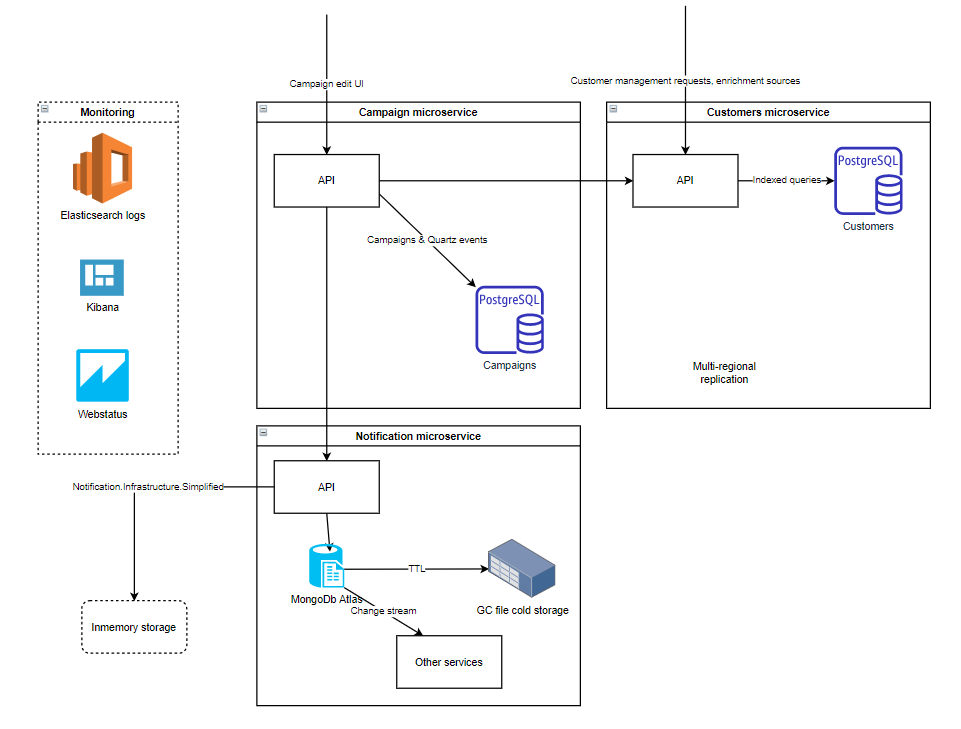

## About the project

### Purpose
To create a service which is able to process huge amount of clients for marketing campaigns.
It should be able to find customers by filters declared in each campaign and execute notification events by sending them at specific time on daily basis. Each client should receive no more than 1 notification per day.

### Architecture

Application consists of 3 microservices:
- Campaign microservice handles campaign rules and orchestrates the overall sending process
- Customers microservices handles customer management and search capabilities. It intended to have separate UI, also it may have some automatic sources. It can be deployed globally with data replication to be available for end customers/to have more optimal fullfillment/to be close to data sources.
- Notification microservice manages notifications logic, it stores events and later saves them to a cold storage. Also it produces a real action such like email sending or other contact points.

The process is the following:
Customer service stores huge amount of data in Postgres database, all columns for searching have indexes and every time it inserts a record it makes it optimized to perform querying for campaigns.

Campaign service uses Postgres database to maintain consitency, including further updates to campaigns and its domain logic. It stores campaign configuration and also executions data to maintain its domain constraints. Further updates may include DDD model updates and ACID-critical stuff. That's why Postgres is chosen here. Campaign service creates Quartz daily jobs everytime user posts a campaign. When a job is executing it receives actual data from campaigns configuration and customer services, which provides an endpoint with flexible quering models and search optimized indexes under the hood. Based on this data it executes domain logic using DDD to detect the needed updates and sends notification to the corresponding service.

Notification service is intended to encapsulate logic for broadcasting notifications, also it stores its data and moves to a cold storages as it reaches TTL. It is a serverless service as it should scale upon a huge amount of request comes to it and requires resources to proceed with. It also users a horizontal scaling MongoDb database to store its data. The mechanism which pushes data to Mongo and then through Streams pushes it no the broadcast parties ensures that every notification is stored, can be observed, restarted (in case of broadcasting failed). Old data comes to a cold storage to reduce usage costs. 

Campaign and customer service will be on stateful container, while notification is on on-demand plan.  

### Business logic considerations
When a job is executing it might ecounter the following circumstances:
- A corresponding campaign doesn't exist:
    It is a corner case when the process comes in between database campaign removal and job unschedule operations
- User has already got a notification despite of there is no other caimpaigns for it.
    May happend when another campaign is executed today but later deleted. We still do not send further campaigns today. That's why Activity data is important to store in this service (while it does not belong to Notification as it depends on internal Campaign microservice logic and may be deleted due to its reasons).
- User has another campaign with more priority for today.
    We skip this campaign, here's why priorities used.
- Campaign got a change to its query.
    New job executions to come with the updated logic as an update intends it is applied as soon as it's made.

### Business critical scenario
When a job is executing it reads campaigns configuration and finds the actual campaign to execute, it contains query expression. 
Then it queries customers by performing an indexed query to the customers service.
The receieved list of customers is to be validated upon: today's executions, more priority campaigns.
If it passed all steps and left as applicable, then it is sent in parallel with others to the notification service. Parallelization here is ok as notification service as on-demand and scaled by instances.

To recap, the process includes:
- Query to campaigns.
- Indexed query for customers that match campaign's conditions.
- Multicolumn-Index query (user, date) to todays activities.
- Internal domain logic.
- Parallel notification sending.

## Technical details

### Run in docker

docker-compose -p marketingfull -f docker-compose.yml -f docker-compose.override.yml up -d --build

docker-compose -p marketingslim -f docker-compose.slim.yml up -d --build

### Add migrations

dotnet ef migrations add MigrationName